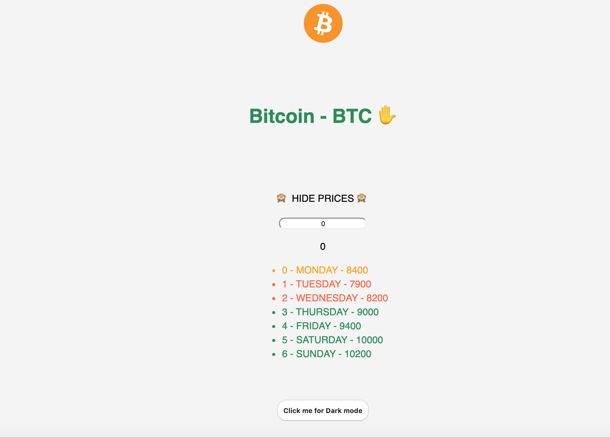

# basic-vue

Here are some basic exercises to learn and practice VueJs

## vue-counter

Increase or decrease the number according to the selected button.

Run the demo here : https://vue-counter.netlify.com/

## vue-modal

Custom modal to practise slots and comunication between components.

Run the demo here :  https://vue-modal.netlify.com/

## vue-tracker

Demo to add the courses made in platzi as well as the hours dedicated to each one. We can know the total hours and also remove courses.

Run the demo here : https://tracker-courses-vue.netlify.com/

## vue-bitcoin

It shows the value of bitcoin as well as a converter. You can also set dark / light mode on the website.

Run the demo here : https://vue-bitcoin.netlify.com/

